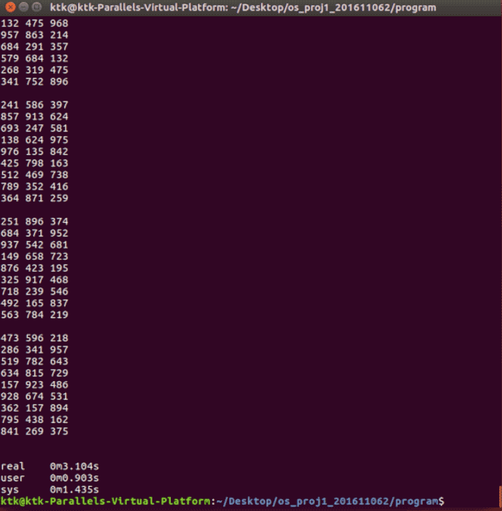
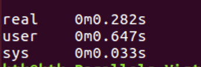

C-FastSudoku
===
Amazingly fast sudoku solver, coded in C.

## Dependency
```bash
#include <stdio.h>
#include <stdlib.h>
#include <semaphore.h>
#include <pthread.h>
```

## The format of input/output
### Input
The top most number indicates number of test case. Each problem is separated by an empty line. '0' means blank. If you have another format of input/output, you should change some implementations.
```bash
100000
074 130 805
156 270 943
938 065 127
523 817 604
619 004 730
002 750 489
781 042 356
095 386 201

709 482 106
641 090 823
005 631 947
402 956 008
000 317 462
076 240 519
053 169 274
920 570 681
067 020 395

...
```

### Output
```bash
274 139 865
156 278 943
938 465 127
523 817 694
619 524 738
362 751 489
781 942 356
495 386 271

739 482 156
641 795 823
285 631 947
412 956 738
598 317 462
376 248 519
853 169 274
924 573 681
167 824 395

...
```

## How to run 
You should compile the code befor you run it. Or use my Makefile.

```bash
gcc -pthread -o fastSudoku fastSudoku.c -O2

or

Make
```
You need a problem set file to scanf().

If you want to print the results on the terminal, then
```bash
./fastSudoku <prob_big.out

```
Or, ff you want to print the results in the out file, then
```bash
./fastSudoku <prob_big.out >sol_big.out

```
If you want to check the execution time, add 'time' in front of them.
```bash
time ./fastSudoku <prob_big.out >sol_big.out

```

## How to evaluate
run 'tester.out' to evaluate the results. If everything correct, you can see '0/100000(errorr/all test)'.
```bash
./tester.out sol_big.out

```

## Multithreading
Firstly, I tried to make one producer (who scanf() and make problem sets), four consumers (who solve problem sets) and one printer (who printf() to make output) with semaphores. But I found it takes even more time than single thread, because it takes more time on the printer, so the producer and consumers are waiting for the lock. 

So I changed it to make one producer, one consumer and one printer to work simultaneously on the large allocated memory. It wastes memory a lot, but my code is concentrated on the performance. 

## Result
My testing environment is MacBook Pro (15-inch, 2015), 2.5 GHz Intel Core i7, and runs Ubuntu 16.04 with parallels Desktop. The gifs below is the results of running 100,000 test cases. 



Printing results on the terminal.


Printing results to the out file. The best result I have is 0.282 secs. 




## To make faster
I am using scanf() and printf(), but you can make it faster by using another IO functions. Such as getchar() and putchar().
